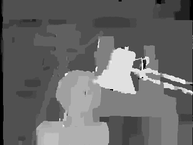

# Loopy Belief Propagation for Stereo Matching (Sum-Product, Max-Product, Min-Sum)

MATLAB implementations of Loopy Belief Propagation (LBP) for stereo matching, featuring Sum-Product, Max-Product and Min-Sum message-passing algorithms for disparity estimation.

## Input Image
The Tsukuba stereo image that used as input.

 

## Output Image
The disparity maps that created at the output.

### Sum-Product

### Max-Product

### Min-Sum

